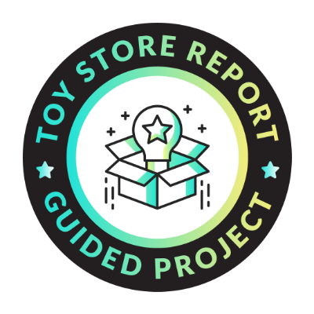

# 🧸 Maven Toys KPI Report | Power BI Dashboard


---

## 📋 Project Overview

Built an interactive KPI dashboard for **Maven Toys Mexico Sales** data using Power BI Desktop.  
This project was completed as part of the **Maven Analytics Guided Project** instructed by **Aaron Parry**.

| Detail | Info |
|---|---|
| **Tool** | Power BI Desktop |
| **Dataset** | Maven Toys Mexico Sales |
| **Source** | Maven Analytics |
| **Level** | Basic |
| **Topics** | Retail, Time Series, Geospatial |

---

## 📊 Key Results

| Measure | Value |
|---|---|
| Total Revenue | $14.44M |
| Total Cost | $10.43M |
| Total Profit | $4.01M |
| Profit Margin % | 27.79% |
| Total Orders | 829K |
| Stores Analyzed | 50 |
| Date Range | Jan 2022 — Sep 2023 |

---

## 🎯 Objectives Completed

### ✅ Objective 1 — Connect and Profile the Data
- Connected 4 CSV files: Sales, Products, Stores, Calendar
- Profiled all tables — no nulls or errors found
- Added 9 columns to Calendar table including Start of Month and Start of Week

**Data Summary:**
- **Sales:** 829,262 rows | 5 columns
- **Products:** 35 rows | Price range $2.99 — $39.99
- **Stores:** 50 stores | 4 locations
- **Calendar:** 638 rows | Jan 2022 — Sep 2023

---

### ✅ Objective 2 — Create a Relational Model
- Built Star Schema with SALES as Fact Table
- Created 3 One-to-Many relationships:

```
CALENDAR  --(Date)---------> SALES
PRODUCTS  --(Product_ID)--> SALES
STORES    --(Store_ID)-----> SALES
```

- Created Date Hierarchy: Start of Month > Start of Week > Date
- Hidden foreign keys (Date, Store_ID, Product_ID) from Report View

---

### ✅ Objective 3 — Add Calculated Measures & Fields

**DAX Measures created:**

```dax
Revenue        = SUMX(SALES, SALES[Units] * RELATED(PRODUCTS[Product_Price]))
Cost           = SUMX(SALES, SALES[Units] * RELATED(PRODUCTS[Product_Cost]))
Profit         = [Revenue] - [Cost]
Profit Margin% = DIVIDE([Profit], [Revenue], 0)
Total Orders   = COUNTROWS(SALES)
Total Revenue  = [Revenue]
Total Profit   = [Profit]

-- BONUS Measures (without referencing calculated columns)
Total Revenue (Direct) = SUMX(SALES, SALES[Units] * RELATED(PRODUCTS[Product_Price]))
Total Profit (Direct)  = SUMX(SALES, SALES[Units] * (RELATED(PRODUCTS[Product_Price]) - RELATED(PRODUCTS[Product_Cost])))
```

---

### ✅ Objective 4 — Build an Interactive Report

**Dashboard includes:**
- 3 KPI visuals (Total Revenue, Total Orders, Total Profit) with monthly trends
- Store Location slicer (Airport, Commercial, Downtown, Residential)
- Bar Chart — Total Orders by Product Category
- Line Chart — Total Revenue by Date Hierarchy (drill down enabled)

---

## 🏆 Final Project Question

> **What was the total revenue for Arts & Crafts products in February 2023?**

**Answer: 187,713**

**February 2023 Revenue Breakdown:**

| Category | Revenue |
|---|---|
| Art & Crafts | $187,713.10 |
| Electronics | $98,999.69 |
| Games | $131,745.03 |
| Sports & Outdoors | $85,848.12 |
| Toys | $218,326.25 |
| **Total** | **$722,632.19** |

---

## 🏅 Badge

Earned the **Toy Store KPI Report** badge from Maven Analytics upon project completion.

---

## 👩‍💻 Author

**Roshni Pandey**  
[LinkedIn](https://www.linkedin.com/in/roshni-pandey-827988215) | [GitHub](https://github.com/RoshniPandey1)
